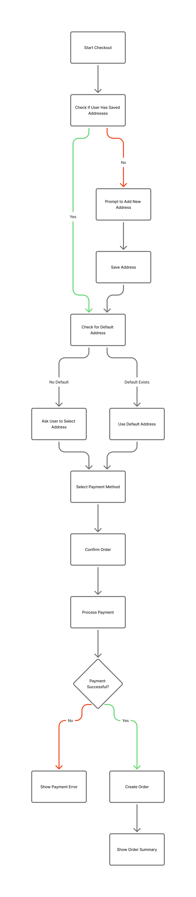

# 🛒 E-Commerce System

<p align="center">
  
</p>

## 📖 Overview

This project is a **full-featured e-commerce system** built with **Laravel 12**, **Filament Admin**, and **Inertia.js (React frontend)**.  
It provides a clean and modular architecture for managing products, handling customer orders, and processing payments — while showcasing both **admin** and **customer** flows.

The goal is to demonstrate practical, real-world e-commerce logic and architecture for portfolio and learning purposes.

---

## ⚙️ Tech Stack

| Layer              | Technology                     |
| ------------------ | ------------------------------ |
| **Framework**      | Laravel 12                     |
| **Admin Panel**    | Filament                       |
| **Frontend**       | Inertia.js + React +Typescript |
| **Database**       | MySQL                          |
| **Environment**    | Docker (Laravel Sail)          |
| **Authentication** | Laravel authentication         |
| **Other Tools**    | Git, Composer, NPM             |

---

## 🧠 System Flowcharts

|  #  | Flowchart                              | Description                                                               |
| :-: | -------------------------------------- | ------------------------------------------------------------------------- |
| 1️⃣  | **System Overview (Admin + Customer)** | Shows the overall system interaction between users, products, and orders. |
| 2️⃣  | **Product Management (Admin)**         | Displays CRUD flow and image upload handling.                             |
| 3️⃣  | **Checkout & Payment Flow (Customer)** | Visualizes the checkout process, decision flow, and payment logic.        |
| 4️⃣  | **Order Fulfillment Flow (Admin)**     | Outlines how admins process and fulfill customer orders.                  |
| 5️⃣  | **User Registration & Login**          | Describes the authentication flow including verification logic.           |

---

## 🗺️ Flowchart Visuals

#### 1️⃣ System Overview (Admin + Customer)


#### 2️⃣ Product Management (Admin)


#### 3️⃣ Checkout & Payment Flow



#### 4️⃣ Order Fulfillment Flow


#### 5️⃣ User Registration & Login


---

## 🚀 Getting Started (with Docker + Laravel Sail)

To set up and run this project locally using **Laravel Sail**, follow the steps below:

```bash
# 1️⃣ Clone the repository
git clone https://github.com/JomarGZ/shophub.git
cd shophub

# 2️⃣ Copy environment file
cp .env.example .env

# 3️⃣ Install dependencies
composer install
npm install

# 4️⃣ Start Docker containers
# (Make sure Docker Desktop or Docker Engine is running)
./vendor/bin/sail up -d

# 5️⃣ Generate application key
./vendor/bin/sail artisan key:generate

# 6️⃣ Run migrations and seeders
./vendor/bin/sail artisan migrate --seed

# 7️⃣ Compile front-end assets
./vendor/bin/sail npm run dev
```
